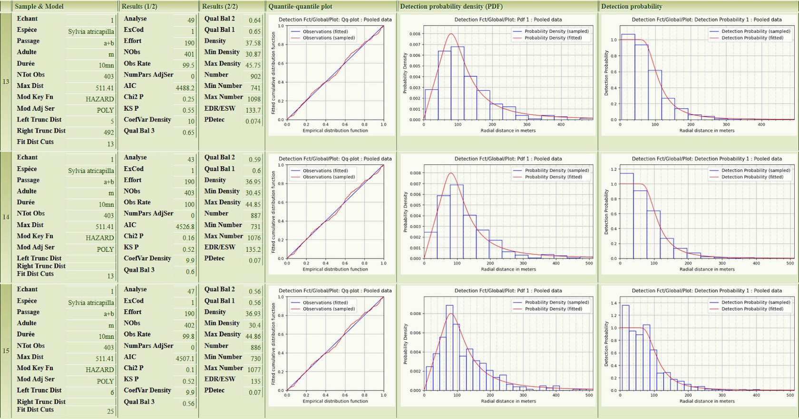

pyaudisam: How it works ...
-----------------------------

Thanks to [DeepL](https://www.deepl.com/translator) for its free, excellent and instant translation !

# I. Sum-up operation of pyaudisam

In the first mode, known as "**pre-analysis**",
* as input, it is provided with
    - the set of **individualised data** (1 data = 1 contact), each data specifying for example: the species, the seasonal passage concerned (1st or 2nd), the "sex and age" of the individual contacted (adult male, other adult = female or undetermined, or juvenile), and of course, the distance between the observer and the bird,
    - the **list of samples to be pre-analysed**: the combinations species x survey duration (5mn or 10mn) x sex and age x passage,
* The software then performs a series of **simple analyses** (1 analysis = 1 call to MCDS) for each of these samples, without any truncation, following the following strategy : try successively the available models and their associated fit series, in a specified order, and **stopping at the first analysis that succeeds** without error (the series of analyses performed is therefore often limited to one); if no analysis succeeds, the sample is considered simply unusable in Distance Sampling (but this is debatable: if it has enough data, with good truncation, it might be possible to "recover" it),
* in output, it produces a **synthesis report** presenting the **essential numerical and graphical results** of the analysis done (successfully) for each sample, in the form of a table with 1 line per sample (see below some details); in this table, the main thing is the histogram of the distances (in fact several superimposed, with different widths of distance slices) and the modelling curves computed by MCDS, which make it possible to evaluate rather quickly for each sample :
    - the chances of obtaining densities of good statistical quality,
    - possibly the specific truncations that it would be reasonable/interesting to try when we are really going to launch the analyses with multiple combinations of parameters (left truncation in particular, e.g. for species with a low number of data at short distance, such as Alauda arvensis, Prunella modularis, ...)

In the second mode, known as "**analysis mode**",
* as input, it is provided with
    - the set of **individualised data** (the same as for the "pre-analysis" mode: the data of the selected samples will be extracted automatically),
    - the **list of samples to be analysed**: as in the "pre-analysis" mode, but a priori a subset, the pre-analyses being made to filter the non-exploitable samples,
    - the **combinations of analysis parameters to be covered for each sample**; this time, it is different from the pre-analysis mode: it is necessary to specify what one wants to do: model x fit series x left truncation distance x right truncation distance x number of distance slices to be considered for the modelling (N.B. for these last 3 parameters, an "automatic" mode makes it possible not to have to specify the values, and to let the software seek them itself by numerical optimisation of the statistical quality of the results of the DS analysis), 
* The software then automatically carries out the following main steps:
    - for the "automatic truncation" parameter combinations, **automatic determination of the left and right truncation distances** by an optimisation technique (launch of numerous analyses by varying the said truncations within limits set by the number of ignored data, considered as "outliers", ... and retaining only the best set of truncations (left and/or right) according to a "combined quality" indicator / criterion based on the indicators produced by MCDS and the analysis parameters (see below for a first overview, and chapter II for all the details);
    - **execution of the individual analyses** corresponding to each of the parameter combinations (with truncations now all fixed) for each sample: as for manual analyses via the Distance 7 software, its MCDS V6 calculation "engine" is used, in "Conventional Distance Sampling" mode (no co-variable); the results thus produced feed a table in which each line corresponds to an analysis, i.e. to one of the parameter combinations for each sample; these results are those produced directly by MCDS V6, and completed by the "combined quality" indicator specific to pyaudisam
    - **automatic sorting and filtering of results** according to their "**combined quality**": for each sample, following a sequence of steps similar to what a human analyst would do "manually" when looking for the "best" analysis result among those corresponding to multiple parameter combinations,
    	+ only retain analyses with non-identical results, to within one epsilon (for raw statistical criteria at the output of MCDS, calculated densities and detection probabilities, as well as their confidence intervals)
        + only retain analyses with no errors reported by MCDS (but analyses with warnings retained),
        + for analyses with strictly identical truncations, keep only the N with the best AIC (configurable N),
        + for analyses with close truncations, keep only the one (only 1) with the best Chi2, the best KS with identical Chi2, the best DCv with identical Chi2 and KS (Chi2 and KS tests = Kolmogorov-Smirnov, DCv = 95% variability of the estimated density),
        + only retain analyses that are "truncated in distance" to less than X% (i.e. for which the truncations in distance to the left and/or to the right have not eliminated more than X% of the total number of birds contacted) (configurable X),
        + keep only the remaining analyses with the best "combined quality" criteria, provided they exceed the minimum value Y (configurable),
        + finally, retain only the (at most) P (configurable) best analyses, to limit the size of the report, but still retaining enough material to manually check the automatic selection and fix it if necessary (see "last manual step" below);
* as an output, it produces **a report (see Chapter IV) presenting, in particular, a summary of the numerical and graphical results of each analysis* retained during the above filtering**, in the form of a summary table (sorted by sample and in decreasing order of the "combined quality" criterion);
* the **last step**, which is **manual**, consists in examining, for each sample, the results of the few "best" analyses retained, and in **choosing which** one to keep: the **automatic filtering** described above **not being perfect**, it is advisable to systematically check that the "best" analysis automatically proposed is indeed "better" than the following ones in the ranking; **for the vast majority of samples, this is indeed the case**, and in any case, the differences in quality criteria and results are small in this ranking; but sometimes, the human analyst must prefer another "better" analysis, to correct the imperfections and shortcomings of the software, in itself, but also with regard to the biases and shortcomings of the field data, thanks to his knowledge of the geographical area surveyed, of the natural environments present and of the targeted species, éléments that give him arguments to sometimes correct the automatism; the following cases seem to be the most frequent :
    - the distance histogram is not regular, has "holes" and/or "bumps", and the software has selected analyses where there is clearly over-modelling, i.e. modelling that tries to get as close as possible to the envelope of the histogram, whereas these "holes" and/or "bumps" should be ignored,
    - natural preference for half-normal modelling,
    - ...

Let us emphasise the importance, in the automatic sorting and filtering process described above, of the "**combined quality**" indicator / criterion calculated from the indicators produced by MCDS and the analysis parameters (see Chapter II for all the details): built with the **ideal objective** of automatically **guiding the selection of the best analyses** as much as possible, it simulates, in a way and in a very simple manner, the **preferences of an experienced human analyst** (according to the current state of our practical knowledge of Distance Sampling):
* the Half-Normal model is preferred, followed closely by the Uniform model; the Hazard-Rate model is less sought after (for often departing from ornithological field realities: long "shoulder" at short distance),
* over-fitting of distance histograms should be avoided as much as possible, so analyses with a minimum of model fitting parameters are preferred,
* truncations eliminating little or no data are preferred,
* analyses with low variability of the density estimate (95% confidence interval) are preferred.

The following chapter gives details of the formula for calculating this indicator.

# II. "Combined quality" criterion

This criterion, calculated by pyaudisam between 0 (poor) and 1 (excellent), combines, after normalisation if necessary, certain analysis parameters, as well as the criteria and raw results produced by MCDS:

| Criterion / result                                           | Normalisation méthod (= transition into [0, 1]) |
|--------------------------------------------------------------|------------------------------------------------------ |
| Khi2 test (Khi2)                                             | already in [0, 1] (MCDS)                              |
| Kolmogorov-Smirnov test (KS)                                 | already in [0, 1] (MCDS)                              |
| Cramer-von-Mises test with uniform weighting (CvM-Uw)        | already in [0, 1] (MCDS)                              |
| Cramer-von-Mises test with cosine weighting (CvM-Cw)         | already in [0, 1] (MCDS)                              |
| Rate of individuals (birds) retained after truncations       | simple division by 100                                |
| Half-Normal, Uniform or Hazard-Rate model used  (the 1st considered to be the most consistent with ornithological field reality,  the 2nd somewhat less so, the 3rd even less so)   | Half-Normal => 1,0   Uniform => 0,9   Hazard-Rate => 0,6 |
| 95% variability in estimated bird density (DCv)              | exp(-63 * DCv2.8)                                     |
| Number of parameters in the model fit series (polynomial or cosine) | exp(-0.17 * Nb of parameters)                  |

The final value is the product of these 8 normalised values, itself raised to the power of 1/8 (conservation of dimensionality).

# III. Extract from a synthesis report of pyaudisam pre-analyses

The **pre-analysis summary reports** produced by pyaudisam in **HTML format** present, for each "pre-analysed" sample (species, passage(s): a, b or a+b, inventory duration: 5mn or 10mn, type of population: m, or m+a):
* a 3-column table identifying the sample, the pre-analysis, the parameters of the first DS model that worked for this sample, some key figures describing the sample (number of individuals considered, max. contact distance, DS effort), and finally the main results of the pre-analysis (estimated density and 95% confidence interval, estimated number and 95% confidence interval, EDR) as well as some of the usual indicators of statistical quality of DS modelling (AIC, Chi2, KS, CoefVar Density); the information displayed in these 3 columns can be configured,
* 3 graphs allowing to quickly judge "by eye" the usability of the sample (left: histograms of the contact distances, with 3 different widths of distance bands), and the quality of this first DS modelling having worked (middle: modelled probability density of detection, superimposed on the histogram of the field data, all as a function of the distance; right: corresponding modelled integral, superimposed on the histogram of the field data, all as a function of the distance).

The units are specified in the header of the report (not visible in the extract below: here, distances in m, and areas in km2).

For example, here is a partial view of an extract of such a report showing 2 samples (2 species) from the Naturalist dataset.

Here's also the "complete" HTML [2-sample extract of this report](https://github.com/denmedius/pyaudisam/tree/main/docs/how-it-works/preanlys/ACDC2019-Nat-preanalyses-report.html) ([this file in GitHub repo](./preanlys/ACDC2019-Nat-preanalyses-report.html)).

Clicking in the left-hand column (on the row number of the table) takes you to a page of details of the relevant pre-analysis, which is identical in every respect to what Distance 7 would produce (this is all the information produced by MCDS, as in Distance 7).

At the bottom of the main page of the HTML report, there are also traceability tables listing the various parameters and conditions under which the analyses were performed.

A report in **Excel format** can also be generated: it does not contain any graphs, but presents in tabular form (see [example](https://github.com/denmedius/pyaudisam/tree/main/docs/how-it-works/preanlys/ACDC2019-Nat-preanalyses-report.xlsx)):
* on the one hand, the detailed results of each pre-analysis carried out, in totality of what MCDS produces (except for the graphs and textual reports),
* on the other hand, a synthesis (customisable columns) of these results, in the form of a simple extract (customisable) from the columns of the details table.

As an example, here's the [Excel report](https://sylbor63.pagesperso-orange.fr/ds/pyaudisam/docs/how-it-works/preanlys/ACDC2019-Nat-preanalyses-report.xlsx) ([this file in GitHub repo](./preanlys/ACDC2019-Nat-preanalyses-report.xlsx) corresponding to the 2-sample extract given as an example above for the HTML report.

# IV. Extract from a synthesis report of pyaudisam analyses

The **summary reports of the analyses** produced by pyaudisam in **HTML format** present, for each sample analysed (species, passage(s): a, b or a+b, duration of inventory: 5mn or 10mn, type of population: m, or m+a), the "best" analyses in terms of the "combined" quality indicator (see Chapter II).

They are quite similar in form to the pre-analysis reports (see above), except that :
* there is no longer 1 line per pre-analysed sample (all species contacted, all passages, ...), but N lines per selected sample (the 30 species, the single combination of passages b or a+b, the single combination of size type m or m+a, the 2 combinations of durations 5mn and 10mn), corresponding to the N best analyses (N being one of the parameters of the filtering and sorting scheme chosen for the report),
* per line, the 3-column table gives more details: in particular the truncations used, and the "combined" quality indicator ("Qual Equi 3" here, but this is also configurable), criterion for ranking the analyses per sample (the best first, at the top); the information to be displayed in these 3 columns is configurable,
* of the 3 graphs allowing to judge quickly "by eye" the quality of the results of the analysis, the first one, on the left, has been logically replaced by the diagram quantile - quantile of comparison modelling - field data; no change on the other hand in the middle and on the right: in the middle, modelled probability density of detection, superimposed on the histogram of the field data, the whole as a function of the distance, and on the right, corresponding integral, modelled, superimposed on the histogram of the field data, the whole as a function of the distance).

Similarly, the units are specified in the header of the report (not visible in the extract below: here, distances in m, and areas in km2).

Clicking in the left-hand column (on the line number of the table) takes you to a page of details of the analysis concerned, identical in every respect to what the Distance 7 software would produce (this is, moreover, all the information produced by MCDS, as in Distance 7).

As an example, here is a partial view of an extract of such a report presenting the 3 best analyses of the sample `Sylvia atricapilla Males Naturalist 10mn`:

Here's also the "complete" HTML [3-analysis extract of this report](https://sylbor63.pagesperso-orange.fr/ds/pyaudisam/docs/how-it-works/optanlys/ACDC2019-Nat-optanalyses-report.ExAicMQua-r925m8q3d12.html) ([this file in GitHub repo](./optanlys/ACDC2019-Nat-optanalyses-report.ExAicMQua-r925m8q3d12.html).

Below this summary table, 2 other tables listing the analyses in the same order present respectively 
* a selection of the columns of parameters, statistical indicators and results of each analysis (an enriched selection compared to the synthesis table above, i.e. approximately 45 columns),
* the totality of columns of parameters, statistical indicators and results of each analysis, as produced by MCDS (about 120 columns), in case of specific needs.

It is also possible to produce a "**full" HTML report**, which presents in exactly the same form the results of **ALL** the analyses performed, not just the best N of each sample (beware: depending on the number of combinations of analysis parameters tested, this report may be substantial!)

At the bottom of the main page of the HTML report, there are also traceability tables listing the various parameters and conditions of the analyses.

A report in **Excel format** can also be generated: it does not contain any graphs, but presents in tabular form:
* for each of the filtering and sorting schemes implemented (not just 1 as in the HTML report), a dedicated sheet giving, grouped by sample and sorted in descending order of the combined quality criterion chosen, the main results (configurable columns) of the N best analyses (Qual Bal 3 for example),
* the detailed results of each analysis performed (not only the N best per sample), in totality of what MCDS produces (except graphs and textual reports),
* a summary of the results (customisable columns) of each pre-analysis performed, in the form of a simple extract (customisable) from the columns of the details table.

As an example, here's the [Excel report](https://sylbor63.pagesperso-orange.fr/ds/pyaudisam/docs/how-it-works/optanlys/ACDC2019-Nat-optanalyses-report.xlsx) ([this file in GitHub repo](./optanlys/ACDC2019-Nat-optanalyses-report.xlsx) corresponding to the 3-analysis extract given as an example above for the HTML report.

Note: Translated with the help of [DeepL](www.DeepL.com/Translator) (free version).

